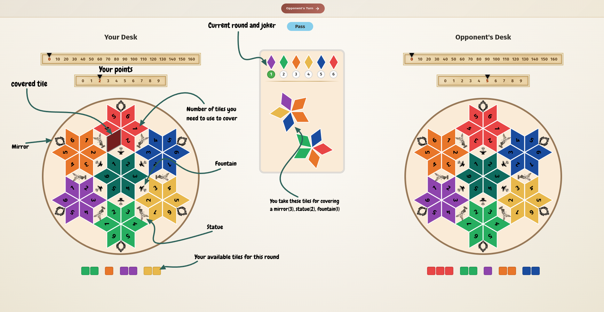
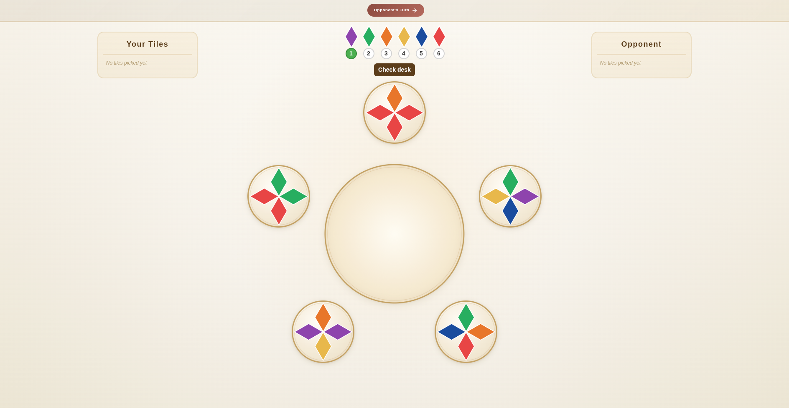

## Azul online board game

This is an online version of the game [Azul](<https://en.wikipedia.org/wiki/Azul_(board_game)>).
Its 'Summer Pavilion' extension to be presized. My girlfriend and I found it such an interesting game,
I couldn't help but make an online version of it.

#### Rules

Azul is a tile-drafting and pattern-building game for 2-4 players, played over 6 rounds.



##### Game consists of:

- 132 tiles in 6 colors (22 of each)
- A central board with factory displays
- Player boards shaped like a 6-pointed star, each point dedicated to one color
- Score track

##### Overview

Players take turns drafting tiles from shared factory displays and placing them on their personal star-shaped board. The goal is to score points by completing stars, covering bonus spaces, and surrounding statues, pillars, and windows.

##### Jokers

Each round has a designated joker that rotates in a fixed order across the 6 rounds:

| Round | Joker  |
| ----- | ------ |
| 1     | Purple |
| 2     | Green  |
| 3     | Orange |
| 4     | Yellow |
| 5     | Blue   |
| 6     | Red    |

Joker tiles can be used as any color when placing tiles on the board.

##### Round Structure

Each round consists of three phases:

1. **Acquire tiles** - Players take turns drafting tiles from factory displays.
2. **Place tiles** - Players place acquired tiles onto their star board.
3. **Prepare next round** - Leftover tiles are discarded and new factories are filled.

##### Acquiring Tiles


On your turn, you must pick tiles from either a factory or the center:

- **From a factory display:** Choose all tiles of one color from a single factory. All remaining tiles on that factory are moved to the center of the table.
- **From the center:** Choose all tiles of one color from the center.

In both cases, you also take one joker tile along with your chosen color if there is one.

Your turn passes to the next player. Drafting continues until all tiles have been taken from all factories and the center.

##### Placing Tiles

After all tiles are drafted, players place tiles onto their star board:

- The star has 6 points, each corresponding to one color and containing spaces numbered 1 through 6.
- To fill a space numbered N, you must spend exactly N tiles of that star's color (joker tiles may substitute for any color).
- Any tiles you cannot or choose not to place are lost (returned to the supply), with a maximum of 4 tiles that can be kept for the next round. Currently, you can keep them for the next round.
- For the center you can choose any color to cover a space, however, this color mustn't have been used in the center already.

##### Tiles

Tiles are returned from the shuffled bag, however, if there aren't enough, we'll add tiles that have been used.

##### Scoring

When you place a tile on a space, you score:

- 1 point for the tile itself.
- 1 additional point for each adjacent tile already on the board (connected horizontally or diagonally in a contiguous group).

##### Bonus Tiles

In certain circumstances, you can pick up bonus tiles from the center:

| Condition                     | Tiles |
| ----------------------------- | ----- |
| Cover tiles around a fountain | 1     |
| Cover tiles around a statue   | 2     |
| Cover tiles around a mirror   | 3     |

##### Bonus Scoring

At the end of the game, bonus points are awarded:

| Condition                           | Bonus Points   |
| ----------------------------------- | -------------- |
| Complete a full star (all 6 spaces) | Varies by star |
| Cover all 1-spaces across all stars | 4              |
| Cover all 2-spaces across all stars | 8              |
| Cover all 3-spaces across all stars | 12             |
| Cover all 4-spaces across all stars | 16             |

Here are bonus points for a completed star:

| Star completed | Points |
| -------------- | ------ |
| Center         | 12     |
| Red            | 14     |
| Blue           | 15     |
| Yellow         | 16     |
| Orange         | 17     |
| Green          | 18     |
| Purple         | 20     |

##### End of Game

The game ends after 6 rounds. The player with the most points wins.

---

### How to get it running

##### Prerequisites

- [Node.js](https://nodejs.org/) (v18 or later)
- [pnpm](https://pnpm.io/)

##### Setup

1. Clone the repository and install dependencies:

```
git clone git@github.com:Syozik/Azul.git
cd Azul
pnpm install
```

2. Create a `.env` file in the project root with the database URL:

```
DATABASE_URL="file:./dev.db"
```

3. Generate the Prisma client and apply migrations:

```
pnpm prisma generate
pnpm prisma migrate deploy
```

##### Running the app

```
pnpm dev # to run in development
```

```
pnpm build
pnpm start # to run in production
```

This starts the Next.js dev server with the Socket.io backend on `http://localhost:3000`, if not specified differently.

##### Running with Docker

##### Prerequisites

- [Docker](https://www.docker.com/)
- [Docker buildx plugin](https://docs.docker.com/reference/cli/docker/buildx/) Requires Docker 19.03+

0. Create a `.env` file in the project root with the database URL:

```
DATABASE_URL="file:./dev.db"
```

1. Build the image:

```
docker build buildx -t azul .
```

2. Run the container:

```
docker run -p 3000:3000 azul
```

The app will be available at `http://localhost:3000`.

---

#### Some (not really) important notes

- This was (and still is, khm-khm) meant to be played by just two of us, so I didn't overcomplicate things.
  But the game, its front and back -ends are easily extensible to make it possible to be played by more than 2 people.
  Some changes to the websocket surely would have to be made, but the architecture is pretty simple.
- I definitely gotta improve responsiveness of the design, some hard choises were made, back when I was calculating
  all those sines and cosines for a proper star layout, I ended up with hardcoded tile dimensions to speed things up.
  Although some steps in that directions were made, and it even works on mobile, it's really far from being good.
- If by some chance a fan of the original game stumbles upon this, they should know that any ideas, suggestions, issues, prs
  are more than welcome.
  Future ideas that I plan to work on whenever I will have time:
- Add 4 tile spaces that we can leave for the next round, now you can pass and all tiles are kept.
- Deploy it somewhere :). Now I just host it locally.
- Responsiveness, responsiveness, responsiveness.
- Add visual rules to the app.
- Collect enough data to figure out the strategy to beat my gf's butt 95% of the time.
